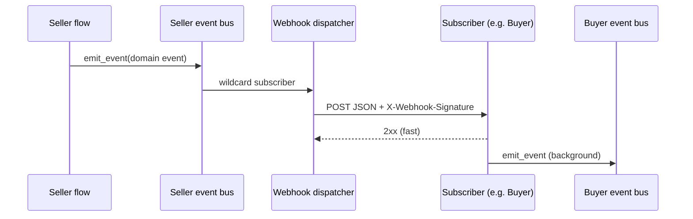

# Webhooks and Event Streaming — Technical Documentation

**Purpose**: Single reference for what already existed for real-time events, what the new HTTP webhook layer adds, and how messages move through the system in real time. Suitable for export to Word/PDF.

**Scope**: IAB OpenDirect 2.1 **Seller Agent** and **Buyer Agent** (sibling repo `../buyer-agent`), as of April 2026.

**Related internal drafts**: `WebhookAndStreamWorkflow.md` (seller-centric event bus, Redis, MCP SSE, deals push), `webhookUsecase.md` (cross-agent patterns and roadmap).

---

## 1. Terminology

| Term | Meaning |
|------|---------|
| **Event bus** | In-process publish/subscribe for domain events (`emit_event` → subscribers). |
| **Event stream (Redis)** | When storage is Redis-capable, persisted events are also published on Redis channels for external subscribers. |
| **MCP SSE** | Model Context Protocol over Server-Sent Events (`GET /mcp/sse`) for AI clients. |
| **Webhook (new)** | HTTP POST from seller to a subscriber URL when an event occurs, with optional auth, HMAC signature, retries, and delivery history. |
| **Webhook receiver (new, buyer)** | HTTP POST endpoints on the buyer that accept seller-style payloads and fan into the buyer event bus. |

---

## 2. What Was Already Present

### 2.1 Seller Agent — Event bus and persistence

- **Event bus** (`src/ad_seller/events/`): `publish` / `subscribe`, wildcard support, fail-open emission from flows.
- **Event model**: `event_id`, `event_type`, `timestamp`, `flow_id`, `flow_type`, optional `proposal_id` / `deal_id` / `session_id`, `payload`, `metadata`.
- **REST history**: `GET /events`, `GET /events/{event_id}` for audit and polling (documented in `WebhookAndStreamWorkflow.md`).

### 2.2 Seller Agent — Real-time streaming without webhooks

- **Redis Pub/Sub** (when configured): channel pattern `ad_seller:channel:events:{event_type}`; payload is the full event JSON. Sub-second fanout to any process that can `SUBSCRIBE` / `PSUBSCRIBE`.
- **MCP SSE** (`/mcp/sse`): long-lived SSE for MCP clients; tools plus asynchronous notifications as the system runs.
- **IAB Deals API push** (`POST /api/v1/deals/push`): seller-initiated HTTP to buyer URLs to distribute deal objects — **business** push, not the same as the new **subscription webhook** framework.

Together, these gave **pull** (REST), **brokered push** (Redis), and **assistant streaming** (MCP SSE), with documentation explicitly favoring that model over traditional callback webhooks.

### 2.3 Buyer Agent — Event bus and persistence

- **In-memory event bus** with sync/async helpers, SQLite persistence for events, `GET /events` style APIs (port and paths per deployment).
- **MCP client** using SSE to talk to the seller (`mcp.client.sse`).
- **State machines** emitting lifecycle-related behavior (deals, campaigns) as described in `webhookUsecase.md`.

There was **no** first-party HTTP webhook **receiver** on the buyer or **dispatcher** on the seller in the committed baseline; `webhookUsecase.md` described target patterns and APIs as a specification.

---

## 3. What Is New (Uncommitted / In-Progress Implementation)

### 3.1 Seller Agent — Outbound webhooks

| Area | Role |
|------|------|
| **`src/ad_seller/models/webhooks.py`** | `WebhookSubscription` (URL, event list, filters, auth, status, per-subscription `secret`), delivery records, API DTOs. |
| **`src/ad_seller/webhooks/registry.py`** | Persist subscriptions and indexes under storage keys `webhook:{id}`, `webhook_index:event:{type}`; supports exact event names, `deal.*`-style prefixes, and `*`; tracks deliveries under `webhook_delivery:{webhook_id}:{delivery_id}`; auto-disables subscription after repeated failures. |
| **`src/ad_seller/webhooks/dispatcher.py`** | For each emitted event: resolve subscribers → apply filters → build JSON body → sign with HMAC-SHA256 (`X-Webhook-Signature: sha256=...`) → POST with optional `Authorization: Bearer …` → exponential backoff retries (default 3 attempts, 1s / 2s / 4s) → record each attempt. |
| **`src/ad_seller/interfaces/api/webhooks.py`** | FastAPI router prefix **`/api/webhooks`**: subscribe, list, get, update, delete, list deliveries, manual retry. |
| **`src/ad_seller/interfaces/api/main.py`** | On startup: `bus.subscribe("*", forward_to_webhooks)` so **every** bus event is considered for webhook dispatch; OpenAPI tag **Webhooks**. |

### 3.2 Buyer Agent — Inbound webhooks

| Area | Role |
|------|------|
| **`src/ad_buyer/models/webhooks.py`** | Pydantic models for deal, inventory, negotiation, proposal, and AAMP-shaped payloads. |
| **`src/ad_buyer/webhooks/receiver.py`** | Router prefix **`/webhooks`**: `deal-updates`, `inventory`, `negotiation`, `proposals`, `registry-updates`, plus **`/webhooks/events`** generic router by `event_type` prefix. |
| **`src/ad_buyer/webhooks/verification.py`** | HMAC-SHA256 verification matching seller encoding (`json.dumps(..., sort_keys=True)`). |
| **`src/ad_buyer/webhooks/secrets.py`** | In-memory `WebhookSecretStore`: map **seller base URL** → shared secret (production should back this with a real secret manager). |
| **`src/ad_buyer/webhooks/handlers.py`** | Background handlers that **`emit_event`** on the buyer bus (e.g. map `deal.registered` / `deal.synced` → `DEAL_BOOKED`; inventory → `INVENTORY_DISCOVERED`; negotiation → `NEGOTIATION_*`). |
| **`src/ad_buyer/interfaces/api/main.py`** | Mounts webhook router; adds webhook paths to **`_PUBLIC_PATHS`** so they bypass normal API auth middleware (signature verification is intended to stand in for auth). |

---

## 4. How It Works in Real Time

### 4.1 End-to-end path (seller → subscriber)

The latency-critical path is **in-process**, then **HTTP**:

1. A seller flow calls `emit_event(...)` (same as before).
2. The event is handled by the configured **event bus** (persist + any Redis publish + in-process subscribers) — unchanged for existing consumers.
3. **New**: the wildcard subscriber `forward_to_webhooks` runs **`WebhookDispatcher.dispatch_event`**.
4. The registry loads all **active** subscriptions that match:
   - exact `event_type` string (e.g. `deal.created`),
   - or a stored prefix key such as `deal.*`,
   - or a global `*`.
5. **Filters** (optional) run in the dispatcher: `buyer_id` vs `event.metadata`, `deal_type` vs `event.payload`, `min_deal_value` vs `payload.total_cost`, `inventory_types` vs `payload.inventory_type`.
6. For each remaining subscription, the dispatcher builds a **WebhookPayload**-shaped dict (top-level `webhook_id`, `event_type`, `event_id`, ISO `timestamp`, optional `deal_id` / `proposal_id` / `session_id`, nested `payload` from the event) and POSTs it.
7. Non-2xx responses or timeouts are retried with backoff; failures increment `failure_count` and can set status to **`failed`** after 10 failures on a logical delivery chain.

So “real time” here means: **as soon as the event is published on the seller bus**, eligible webhooks are notified in parallel, typically within **tens to hundreds of milliseconds** plus network RTT to each URL — **not** queued for batch export unless the HTTP layer is slow or down.

### 4.2 Buyer receiver path (HTTP → buyer bus)

1. Seller POSTs to a buyer URL (dedicated route or `/webhooks/events`).
2. **Signature**: `X-Webhook-Signature` is **required** by the receiver code path; verification uses a secret looked up by `seller_url` from the JSON body or **`X-Seller-URL`** header. If no seller URL or no configured secret, the implementation currently **logs and allows** the request (fail-open for development).
3. **Idempotency**: `event_id` is tracked in a **process-local** set (with a coarse eviction strategy); duplicates return `{"status": "duplicate"}`.
4. **Fast ACK**: Endpoints enqueue **`BackgroundTasks`** and return `accepted` immediately; handlers run asynchronously and call **`emit_event`** so dashboards, Redis (if any), and other buyer subscribers see updates **after** the HTTP response.

### 4.3 Sequence (conceptual)



### 4.4 Relationship to Redis and MCP (unchanged)

- **Redis subscribers** still receive the **full internal event** on `ad_seller:channel:events:…` when that backend is enabled.
- **Webhooks** receive a **trimmed, stable JSON contract** (`WebhookPayload`) suited for HTTP receivers, not necessarily identical field-for-field to the Redis message.
- **MCP SSE** remains a separate transport for MCP clients; it is not replaced by webhooks.

---

## 5. API Summary (Seller)

Base path: **`/api/webhooks`** (OpenAPI tag **Webhooks**).

| Method | Path | Purpose |
|--------|------|---------|
| POST | `/api/webhooks/subscribe` | Create subscription (`url`, `events`, optional `filters`, optional `auth`). |
| GET | `/api/webhooks` | List subscriptions. |
| GET | `/api/webhooks/{webhook_id}` | Get one. |
| PUT | `/api/webhooks/{webhook_id}` | Update `events`, `filters`, `status` (`active` / `paused` / `failed`). |
| DELETE | `/api/webhooks/{webhook_id}` | Remove subscription and stored deliveries. |
| GET | `/api/webhooks/{webhook_id}/deliveries` | Delivery history (optional `status` filter). |
| POST | `/api/webhooks/{webhook_id}/retry` | Retry selected `delivery_ids`. |

**Subscribe example** (illustrative):

```json
{
  "url": "https://buyer.example.com/webhooks/events",
  "events": ["deal.created", "deal.registered", "proposal.evaluated"],
  "filters": {
    "buyer_id": "buyer-789",
    "deal_type": ["PG", "PD"]
  },
  "auth": {
    "type": "bearer",
    "token": "optional-bearer-token"
  }
}
```

**Outbound POST body** (shape): `webhook_id`, `event_type`, `event_id`, `timestamp`, optional `deal_id`, `proposal_id`, `session_id`, and `payload` (the original event payload dict).

---

## 6. API Summary (Buyer)

Base path: **`/webhooks`** (paths are currently treated as **public** in `main.py`).

| Path | Intended use |
|------|----------------|
| POST `/webhooks/deal-updates` | Deal lifecycle from seller. |
| POST `/webhooks/inventory` | Inventory alerts. |
| POST `/webhooks/negotiation` | Negotiation rounds / conclusion. |
| POST `/webhooks/proposals` | Proposal evaluated / accepted / rejected. |
| POST `/webhooks/registry-updates` | AAMP / registry-style events. |
| POST `/webhooks/events` | Generic: routes by `event_type` prefix (`deal.`, `inventory.`, …). |

Handlers map incoming types into **buyer** `EventType` values where defined; some seller types only log until buyer event types exist.

---

## 7. Security and Operations Notes

1. **HMAC**: Seller signs the **exact JSON object** sent in the POST body (`sort_keys=True` serialization). Verifiers must use the same rule.
2. **Secret alignment**: Each seller subscription has a generated **`secret`** (`WebhookSubscription`). The buyer’s `WebhookSecretStore` keys secrets by **seller URL**. Operators must **provision the same secret** on the buyer for that seller (out-of-band today — the seller list API does not return the secret).
3. **Identifying the seller**: For strict verification, send **`X-Seller-URL`** (or include `seller_url` in the body if you extend the contract) so the buyer can load the correct secret.
4. **Public routes**: Buyer webhook routes skip normal auth middleware; rely on signature + network policy for production.
5. **Idempotency**: Buyer duplicate detection is **in-memory** only; restarts or multiple instances require a shared store for strict exactly-once processing.
6. **Storage**: Seller registry uses the app’s **`get_storage()`** abstraction; webhook keys must be supported by the chosen backend (same as other KV-style usage).

---

## 8. Choosing an Integration Pattern

| Need | Prefer |
|------|--------|
| Same datacenter, many consumers, high throughput | **Redis pub/sub** (existing). |
| Human / AI assistant tooling | **MCP SSE** (existing). |
| Partner has only a public HTTPS endpoint | **Webhooks** (new seller dispatcher + buyer receiver). |
| Occasional audit or debugging | **GET /events** on each agent (existing). |
| Standardized deal object handoff to DSP | **IAB Deals API push** (existing seller feature). |

---

## 9. Source Layout Reference

**Seller (new)**

- `src/ad_seller/interfaces/api/webhooks.py`
- `src/ad_seller/models/webhooks.py`
- `src/ad_seller/webhooks/registry.py`
- `src/ad_seller/webhooks/dispatcher.py`
- `src/ad_seller/interfaces/api/main.py` (bus hook + router include)

**Buyer (new)**

- `src/ad_buyer/webhooks/receiver.py`
- `src/ad_buyer/webhooks/handlers.py`
- `src/ad_buyer/webhooks/verification.py`
- `src/ad_buyer/webhooks/secrets.py`
- `src/ad_buyer/models/webhooks.py`
- `src/ad_buyer/interfaces/api/main.py` (router + public paths)

---

## 10. Document History

| Version | Date | Notes |
|---------|------|--------|
| 1.0 | 2026-04-01 | Initial consolidated doc from `WebhookAndStreamWorkflow.md`, `webhookUsecase.md`, and uncommitted seller/buyer diffs. |

---

**End of document**
