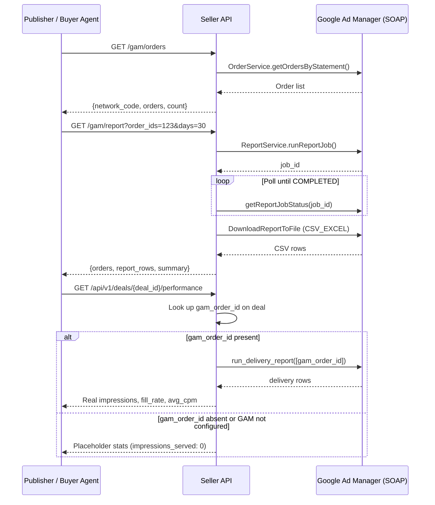

# GAM Delivery Reporting

The seller agent connects to Google Ad Manager (GAM) via the SOAP API to expose
delivery data — impressions served, clicks, and revenue — directly through its REST
endpoints. Publishers can view order-level stats for their own dashboard, and buyer
agents receive real delivery figures through the standard deal performance endpoint.

---

## Prerequisites

| Requirement | Where to get it |
|---|---|
| GAM network code | GAM UI → Admin → Global Settings → Network code |
| Service account JSON key | Google Cloud Console → IAM & Admin → Service Accounts → Create → Download key |
| Service account linked to GAM | GAM UI → Admin → Access & Authentication → API Access → Add service account |

---

## Configuration

```env
GAM_ENABLED=true
GAM_NETWORK_CODE=12345678
GAM_JSON_KEY_PATH=/etc/secrets/gam-service-account.json
GAM_APPLICATION_NAME=AdSellerSystem   # optional, identifies your app in GAM logs
GAM_API_VERSION=v202505               # optional, defaults to v202505
```

See [Configuration Reference](configuration.md) for the full environment variable list.

---

## How It Works



---

## Endpoints

### List Orders

```bash
GET /gam/orders?limit=50
```

Returns the most recent orders from the GAM network with id, name, and status.
Useful for finding order IDs to pass to the report endpoint.

**Example response**

```json
{
  "network_code": "12345678",
  "user": {
    "id": "987654321",
    "name": "my-service-account",
    "email": "seller@project.iam.gserviceaccount.com"
  },
  "orders": [
    {"id": "54058762", "name": "Homepage Campaign Q2", "status": "APPROVED"},
    {"id": "54058882", "name": "Video Pre-Roll Bundle", "status": "APPROVED"}
  ],
  "count": 2
}
```

### Delivery Report

```bash
GET /gam/report?order_ids=54058762,54058882&days=30
```

Submits a GAM report job, polls until complete (up to ~60 s), and returns
line-item-level delivery data for the look-back window.

| Parameter | Type | Default | Description |
|---|---|---|---|
| `order_ids` | string | required | Comma-separated numeric GAM order IDs |
| `days` | int | `30` | Look-back window in days |

**Example response**

```json
{
  "orders": [
    {
      "order_id": "54058762",
      "order_name": "Homepage Campaign Q2",
      "status": "APPROVED",
      "line_items": [
        {
          "id": "1195282",
          "name": "Homepage_728x90",
          "status": "DELIVERING",
          "impressions_goal": 500000,
          "cost_type": "CPM"
        }
      ]
    }
  ],
  "report_rows": [
    {
      "order_id": "54058762",
      "order_name": "Homepage Campaign Q2",
      "line_item_id": "1195282",
      "line_item_name": "Homepage_728x90",
      "impressions": 124830,
      "clicks": 312,
      "revenue_usd": 1872.45
    }
  ],
  "summary": {
    "impressions": 124830,
    "clicks": 312,
    "revenue_usd": 1872.45
  }
}
```

### Deal Performance (A2A)

```bash
GET /api/v1/deals/{deal_id}/performance
```

This endpoint is the standard A2A delivery channel — buyer agents call it to get
delivery stats for a booked deal without direct GAM access.

When a deal has been trafficked into GAM and its `gam_order_id` is recorded, the
seller queries GAM and returns real data. Otherwise it returns placeholder stats
so the endpoint always responds, even before trafficking.

**Example — real data (deal linked to GAM order)**

```json
{
  "deal_id": "DEMO-4128A557FF5C",
  "impressions_available": 500000,
  "impressions_served": 124830,
  "fill_rate": 24.97,
  "win_rate": 0.0,
  "avg_cpm_actual": 15.00,
  "delivery_pacing": "on_track",
  "last_updated": "2026-06-15T09:12:34Z"
}
```

**Example — placeholder (GAM not configured or deal not yet trafficked)**

```json
{
  "deal_id": "DEMO-4128A557FF5C",
  "impressions_available": 1000000,
  "impressions_served": 0,
  "fill_rate": 0.0,
  "win_rate": 0.0,
  "avg_cpm_actual": 0.0,
  "delivery_pacing": "not_started",
  "last_updated": "2026-06-15T09:12:34Z"
}
```

`delivery_pacing` values:

| Value | Meaning |
|---|---|
| `not_started` | No impressions served yet |
| `on_track` | Fill rate ≥ 40% of goal |
| `behind` | Fill rate < 40% of goal |

---

## Linking a Deal to a GAM Order

The seller does not create a GAM order automatically when a deal is booked. After
trafficking the deal in GAM, store the GAM order ID on the deal record so the
performance endpoint can look it up:

```bash
# The deal record in storage accepts a gam_order_id field.
# Set it after you have trafficked the deal in GAM.
#
# Example: deal DEMO-4128A557FF5C was trafficked as GAM order 54058762
curl -X PATCH http://localhost:8000/api/v1/deals/DEMO-4128A557FF5C \
  -H "Content-Type: application/json" \
  -d '{"metadata": {"gam_order_id": "54058762"}}'
```

Once set, `GET /api/v1/deals/{deal_id}/performance` automatically pulls live
delivery data for that order.

---

## Fallback Behaviour

If GAM is not configured or any GAM call fails, every endpoint degrades gracefully:

| Condition | Behaviour |
|---|---|
| `GAM_ENABLED=false` | `/gam/orders` and `/gam/report` return HTTP 503 |
| GAM credentials missing | Same as above |
| Deal has no `gam_order_id` | `/performance` returns placeholder stats |
| GAM API error at runtime | `/performance` silently falls back to placeholder |

This means the seller agent is fully operational without GAM — GAM is an optional
enhancement for publishers who have it configured.

---

## Related

- [Inventory Sync](inventory-sync.md) --- Sync ad unit inventory from GAM into the seller catalog
- [Configuration Reference](configuration.md) --- All GAM environment variables
- [Buyer Agent Integration](../integration/buyer-agent.md) --- How buyers consume the performance endpoint
