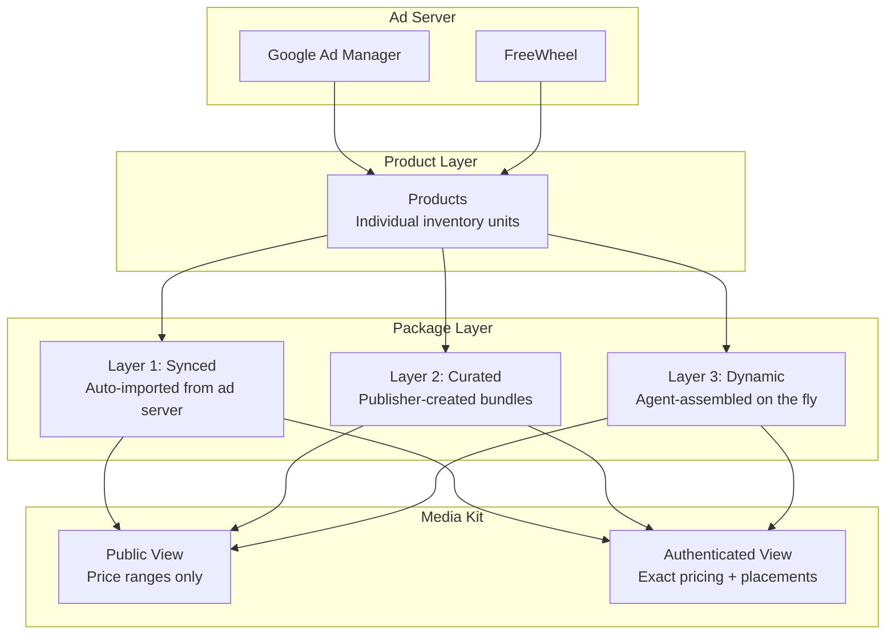
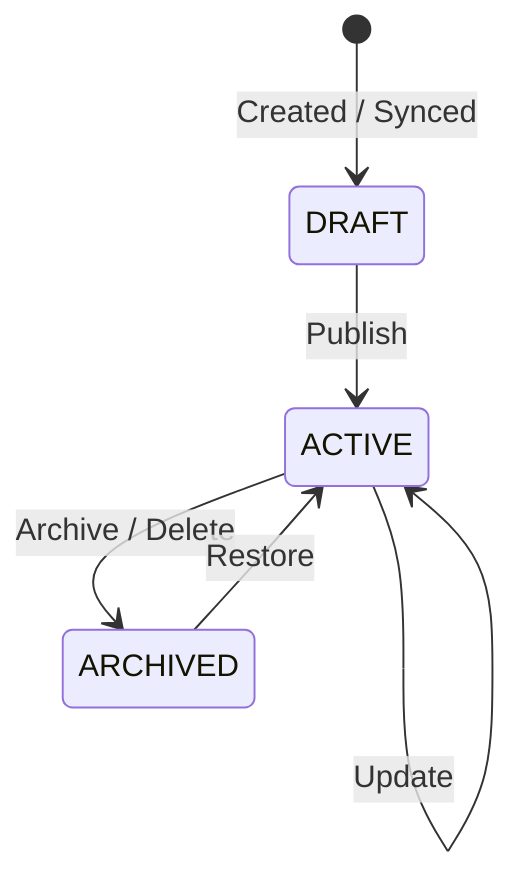

# Media Kit Setup

The media kit is the seller agent's **inventory catalog** — a curated discovery layer that lets buyer agents browse your available ad inventory. It sits on top of your raw products and presents them as browseable, searchable packages with tier-gated pricing.

## How It Works



## Three Package Layers

### Layer 1: Synced (Ad Server Import)

Packages are auto-created when you sync inventory from Google Ad Manager (or FreeWheel). The sync classifies each ad unit by inventory type and generates packages with blended pricing.

```bash
# Trigger an inventory sync
curl -X POST http://localhost:8000/packages/sync
```

See [Inventory Sync](inventory-sync.md) for GAM connection setup and classification rules.

### Layer 2: Curated (Publisher-Created)

Manually create branded packages that bundle specific products with custom pricing, targeting, and metadata.

```bash
curl -X POST http://localhost:8000/packages \
  -H "Content-Type: application/json" \
  -d '{
    "name": "Sports Premium Video",
    "description": "Live sports and highlights across CTV and mobile",
    "product_ids": ["prod-video-001", "prod-ctv-002"],
    "cat": ["IAB19", "IAB19-29"],
    "cattax": "3",
    "audience_capabilities": {
      "standard_segment_ids": ["3", "4", "5"],
      "standard_taxonomy_version": "1.1",
      "contextual_segment_ids": ["IAB19-29"],
      "contextual_taxonomy_version": "3.1",
      "agentic_capabilities": {
        "supported_signal_types": ["identity", "contextual"],
        "embedding_dim_range": [256, 1024],
        "spec_version": "draft-2026-01",
        "consent_modes": ["gdpr", "tcfv2"]
      }
    },
    "device_types": [3, 4, 5],
    "ad_formats": ["video"],
    "geo_targets": ["US"],
    "base_price": 42.00,
    "floor_price": 29.40,
    "tags": ["premium", "sports", "live events"],
    "is_featured": true,
    "seasonal_label": "NFL Season 2024"
  }'
```

**Key fields:**

| Field | Format | Example |
|-------|--------|---------|
| `cat` | IAB Content Taxonomy v2/v3 IDs | `["IAB19", "IAB19-29"]` |
| `cattax` | Content Taxonomy version | `"3"` (CT 3.x) |
| `audience_capabilities` | Typed audience block (see below) | object |
| `device_types` | AdCOM DeviceType integers | `[3, 7]` (CTV, STB) |
| `ad_formats` | OpenRTB format names | `["video", "banner"]` |
| `geo_targets` | ISO 3166-2 codes | `["US", "US-NY"]` |
| `tags` | Human-readable search terms | `["premium", "sports"]` |

#### `audience_capabilities` shape

The flat `audience_segment_ids` field is **deprecated**. Packages now declare a typed `audience_capabilities` block describing what kinds of audiences a package can fulfill across the three IAB-standardized audience types:

| Sub-field | Format | Notes |
|-----------|--------|-------|
| `standard_segment_ids` | IAB Audience Taxonomy 1.1 segment IDs | Replaces flat `audience_segment_ids` |
| `standard_taxonomy_version` | Version string | `"1.1"` |
| `contextual_segment_ids` | IAB Content Taxonomy 3.1 IDs | Audience-level *intent* (vs. `cat`, which is what the content IS) |
| `contextual_taxonomy_version` | Version string | `"3.1"` |
| `agentic_capabilities` | Block or `null` | Declared only by packages that support advertiser first-party activation |

`agentic_capabilities` (when present) carries:

| Sub-field | Format | Notes |
|-----------|--------|-------|
| `supported_signal_types` | Array of `"identity"`, `"contextual"`, `"reinforcement"` | Which IAB Agentic Audiences signal types the package can match on |
| `embedding_dim_range` | `[min, max]` integers | Embedding dimensions accepted, e.g. `[256, 1024]` |
| `spec_version` | Spec version string | `"draft-2026-01"` |
| `consent_modes` | Array of consent regimes | `["gdpr", "tcfv2", "ccpa"]` |

!!! note "`cat` vs. `contextual_segment_ids`"
    `cat` describes what the content IS (e.g. an automotive blog page tagged `IAB-2`). `contextual_segment_ids` describes what the audience is **reading or showing intent toward**. The two often overlap but carry different semantics --- `cat` is about the page; `contextual_segment_ids` is about the audience-level signal derived from page consumption.

#### Positioning your packages

Sellers position packages along three axes parallel to the three audience types. Pick whichever combination matches your inventory's strengths --- packages can sit on multiple axes at once.

| Positioning | What you populate | Best for |
|-------------|-------------------|----------|
| **Standard direct response** | `standard_segment_ids` densely; leave `agentic_capabilities` null | Buyers running portable, third-party-aligned segment buys (CPA, ROAS) |
| **Content-adjacency contextual** | `contextual_segment_ids` paired with `cat` | Buyers running privacy-resilient adjacency targeting; cookieless contexts |
| **Agentic premium tier** | `agentic_capabilities` declared with the signal types you can match on | Buyers activating advertiser first-party signal, lookalikes, dynamic audiences. This is the premium tier --- requires consent infrastructure |

A typical premium package declares all three. A pure direct-response package may only declare the standard tier. The buyer's Audience Planner composes a mixed `AudiencePlan` (Standard primary + Contextual constraint + Agentic extension is the canonical shape) and the buyer's pre-flight degrades the plan against your declared capabilities before booking.

!!! tip "What to declare in each tier"
    Start with what your ad server actually delivers reliably. A package that declares `agentic_capabilities` but cannot honor an embedding-driven match at fulfillment will be dropped from the buyer's seller pool after a single rejection. Better to under-declare and earn upgrades than over-declare and lose the seat.

### Layer 3: Dynamic (Agent-Assembled)

Buyer or seller agents can assemble custom packages on the fly from product IDs. The system computes blended pricing and merges inventory characteristics automatically.

```bash
curl -X POST http://localhost:8000/packages/assemble \
  -H "Content-Type: application/json" \
  -d '{
    "name": "Custom CTV + Mobile Bundle",
    "product_ids": ["prod-ctv-001", "prod-mobile-002", "prod-video-003"]
  }'
```

Dynamic packages are persisted for reference but are typically ephemeral — created during a negotiation session.

## Tier-Gated Access

The media kit shows different levels of detail depending on the buyer's authentication status and access tier.

### What Buyers See

| Data Field | Public (No Auth) | Seat (API Key) | Agency | Advertiser |
|-----------|:---:|:---:|:---:|:---:|
| Package name & description | Yes | Yes | Yes | Yes |
| Ad formats, device types | Yes | Yes | Yes | Yes |
| Content categories (`cat`) | Yes | Yes | Yes | Yes |
| Geo targets | Yes | Yes | Yes | Yes |
| Tags, featured status | Yes | Yes | Yes | Yes |
| **Price range** (e.g. "$28–$42 CPM") | Yes | — | — | — |
| **Exact tier-adjusted price** | — | Yes | Yes | Yes |
| **Floor price** | — | Yes | Yes | Yes |
| **Placements** (product details) | — | Yes | Yes | Yes |
| **Audience capability versions** (no segment lists) | Yes | Yes | Yes | Yes |
| **Audience segment lists** (`standard_segment_ids`, `contextual_segment_ids`) | — | Yes | Yes | Yes |
| **Agentic capabilities** (signal types, dim range, consent modes) | — | Yes | Yes | Yes |
| **Negotiation enabled** | — | — | Yes | Yes |
| **Volume discounts available** | — | — | — | Yes |

### Pricing by Tier

Authenticated buyers receive tier-adjusted pricing. The discount comes from the [Pricing & Access Tiers](pricing-rules.md) configuration:

| Tier | Discount | Example ($35 base) |
|------|----------|-------------------|
| PUBLIC | 0% | "$28–$42 CPM" (range only) |
| SEAT | 5% | $33.25 CPM |
| AGENCY | 10% | $31.50 CPM |
| ADVERTISER | 15% | $29.75 CPM |

## Public Endpoints (No Auth Required)

These are the endpoints buyer agents use to browse your media kit without authentication:

| Method | Path | Description |
|--------|------|-------------|
| `GET` | `/media-kit` | Overview: seller name, featured packages, all packages |
| `GET` | `/media-kit/packages` | List packages (filter by `layer`, `featured_only`) |
| `GET` | `/media-kit/packages/{id}` | Single package (public view) |
| `POST` | `/media-kit/search` | Keyword search across packages |

### Media Kit Overview

```bash
curl http://localhost:8000/media-kit
```

Response:

```json
{
  "seller_name": "Premium Publisher Network",
  "total_packages": 12,
  "featured": [
    {
      "package_id": "pkg-abc12345",
      "name": "Sports Premium Video",
      "description": "Live sports and highlights",
      "ad_formats": ["video"],
      "device_types": [3, 4, 5],
      "cat": ["IAB19"],
      "price_range": "$28-$42 CPM",
      "is_featured": true
    }
  ],
  "all_packages": [...]
}
```

### Search Packages

```bash
curl -X POST http://localhost:8000/media-kit/search \
  -H "Content-Type: application/json" \
  -d '{"query": "sports video"}'
```

Search matches against package name, description, tags, content categories, and ad formats. Featured packages receive a 1.5x score boost.

## Authenticated Endpoints (API Key Required)

These endpoints require an `X-API-Key` header and return richer data including exact pricing and placement details:

| Method | Path | Description |
|--------|------|-------------|
| `GET` | `/packages` | List with tier-gated views |
| `GET` | `/packages/{id}` | Single package with exact pricing |
| `POST` | `/packages` | Create curated package (Layer 2) |
| `PUT` | `/packages/{id}` | Update package |
| `DELETE` | `/packages/{id}` | Archive package (soft delete) |
| `POST` | `/packages/assemble` | Assemble dynamic package (Layer 3) |
| `POST` | `/packages/sync` | Trigger ad server inventory sync |

### Authenticated Package Response

```bash
curl http://localhost:8000/packages/pkg-abc12345 \
  -H "X-API-Key: buyer-key-123"
```

```json
{
  "package_id": "pkg-abc12345",
  "name": "Sports Premium Video",
  "ad_formats": ["video"],
  "device_types": [3, 4, 5],
  "cat": ["IAB19", "IAB19-29"],
  "price_range": "$33 CPM",
  "exact_price": 33.25,
  "floor_price": 29.40,
  "currency": "USD",
  "placements": [
    {
      "product_id": "prod-video-001",
      "product_name": "Live Sports Video - CTV",
      "ad_formats": ["video"],
      "device_types": [3, 7],
      "weight": 1.0
    },
    {
      "product_id": "prod-video-002",
      "product_name": "Sports Highlights - Mobile",
      "ad_formats": ["video"],
      "device_types": [4, 5],
      "weight": 1.0
    }
  ],
  "audience_capabilities": {
    "standard_segment_ids": ["3", "4", "5"],
    "standard_taxonomy_version": "1.1",
    "contextual_segment_ids": ["IAB19-29"],
    "contextual_taxonomy_version": "3.1",
    "agentic_capabilities": {
      "supported_signal_types": ["identity", "contextual"],
      "embedding_dim_range": [256, 1024],
      "spec_version": "draft-2026-01",
      "consent_modes": ["gdpr", "tcfv2"]
    }
  },
  "negotiation_enabled": true,
  "volume_discounts_available": false
}
```

The public view (`PublicPackageView`) exposes only the *versions* (`standard_taxonomy_version`, `contextual_taxonomy_version`, `agentic_capabilities.spec_version`) so buyers can pre-flight compatibility without seeing your segment lists. Authenticated views expose the full segment lists and signal-type details.

## Audience-Aware Discovery

Once a package declares `audience_capabilities`, three buyer-facing surfaces become available for audience-driven discovery and matching.

### 1. Capability advertisement (`/.well-known/agent.json`)

The seller's existing agent-card response carries an additional `audience_capabilities` block summarizing what the seller's media kit can fulfill at the seat level (capability snapshot, not segment lists):

```json
{
  "seller_id": "seller-publisher-x",
  "audience_capabilities": {
    "schema_version": "1",
    "standard_taxonomy_versions": ["1.1"],
    "contextual_taxonomy_versions": ["3.0", "3.1"],
    "agentic": { "supported": true, "spec_version": "draft-2026-01" },
    "supports_constraints": true,
    "supports_extensions": true,
    "supports_exclusions": false,
    "max_refs_per_role": { "primary": 1, "constraints": 3, "extensions": 2, "exclusions": 0 },
    "taxonomy_lock_hashes": {
      "audience": "sha256:9f2c...",
      "content":  "sha256:7b1e..."
    }
  }
}
```

A seller that omits this block is treated as **legacy** by the buyer: standard segments only, no constraints, no extensions, no exclusions, no agentic. That is the safe default.

The buyer caches this response for **at most 1 hour** and honors `Cache-Control: max-age` if you set it. Bumping `schema_version` signals a breaking change; older buyers degrade their expectations conservatively.

### 2. Audience filter on `/packages`

Buyers can filter the package list by audience type and ID:

```bash
# All packages that fulfill standard segment "3-7"
curl "http://localhost:8000/packages?audience_type=standard&audience_id=3-7" \
  -H "X-API-Key: buyer-key-123"

# All packages that fulfill contextual category "IAB1-2"
curl "http://localhost:8000/packages?audience_type=contextual&audience_id=IAB1-2"

# All packages that support agentic activation
curl "http://localhost:8000/packages?audience_type=agentic"
```

The filter matches against the corresponding sub-field of `audience_capabilities`. Multiple filters AND together. `POST /media-kit/search` also folds `audience_capabilities` into its scoring corpus.

### 3. Agentic match endpoint

Buyers send an `AudienceRef` of type `agentic` (carrying an embedding URI) and receive a match-confidence score:

```bash
curl -X POST http://localhost:8000/agentic-audience/match \
  -H "Content-Type: application/vnd.iab.agentic-audiences+json; v=1" \
  -H "X-API-Key: buyer-key-123" \
  -d '{
    "audience_ref": {
      "type": "agentic",
      "identifier": "emb://buyer-x/campaign-q3-lookalike",
      "taxonomy": "iab.agentic-audiences",
      "version": "draft-2026-01"
    },
    "package_id": "pkg-abc12345"
  }'
```

Response includes a confidence score (0.0–1.0) and the package's matched signal types. Buyers typically threshold at 0.7 for "strong match." The endpoint also accepts the legacy `application/vnd.ucp.embedding+json; v=1` content type --- both refer to the same payload shape (see [Naming note](#taxonomy-reference)).

### 4. Structured rejection: `audience_plan_unsupported`

If a buyer sends a `DealBookingRequest` with an `AudiencePlan` that exceeds your declared capabilities (e.g. extensions when `supports_extensions: false`, or an unknown taxonomy version), reject with a structured error:

```json
{
  "error": "audience_plan_unsupported",
  "unsupported": [
    { "path": "extensions[0]", "reason": "extensions not supported by this seller" },
    { "path": "primary.taxonomy", "reason": "version 3.2 not supported" }
  ]
}
```

The buyer's orchestrator catches this, applies degradation based on the structured paths, and retries once. If the retry still fails, the seller is marked incompatible for the campaign and the orchestrator routes elsewhere.

!!! tip "End-to-end flow"
    Capability advertisement + buyer-side pre-flight degradation + structured rejection together form a three-layer capability negotiation contract. See `docs/architecture/capability-negotiation.md` in the agent_range parent repo for the full negotiation flow, cache semantics, and graceful-degradation policy options.

## Managing Your Media Kit

### Recommended Workflow

1. **Sync inventory** from your ad server to create Layer 1 packages:
   ```bash
   curl -X POST http://localhost:8000/packages/sync
   ```

2. **Review synced packages** — they start as DRAFT:
   ```bash
   curl http://localhost:8000/packages?layer=synced
   ```

3. **Create curated packages** for premium bundles you want to feature:
   ```bash
   curl -X POST http://localhost:8000/packages \
     -H "Content-Type: application/json" \
     -d '{"name": "...", "product_ids": [...], "is_featured": true}'
   ```

4. **Mark packages as featured** to highlight them in the media kit overview:
   ```bash
   curl -X PUT http://localhost:8000/packages/pkg-12345 \
     -H "Content-Type: application/json" \
     -d '{"is_featured": true, "seasonal_label": "Holiday 2024"}'
   ```

5. **Archive outdated packages** (soft delete):
   ```bash
   curl -X DELETE http://localhost:8000/packages/pkg-old-123
   ```

### Package Lifecycle



### MCP Tool Access

Agents can also manage the media kit via MCP tool calls:

| Tool | Description |
|------|-------------|
| `search_inventory` | Search and browse available packages |
| `get_product_catalog` | List all products and packages |

## Taxonomy Reference

All taxonomy fields use IAB standard identifiers as canonical values:

| Field | Standard | Examples |
|-------|----------|----------|
| `cat` | IAB Content Taxonomy v2/v3 | `IAB1` (Arts), `IAB19` (Sports), `IAB19-29` (Football) |
| `cattax` | Taxonomy version | `1` = CT1.0, `2` = CT2.0, `3` = CT3.0 |
| `audience_capabilities.standard_segment_ids` | IAB Audience Taxonomy 1.1 | Numeric IDs (`"3"`, `"4"`, `"5"`) |
| `audience_capabilities.contextual_segment_ids` | IAB Content Taxonomy 3.1 | Hierarchical IDs (`"IAB1-2"`, `"IAB19-29"`) |
| `audience_capabilities.agentic_capabilities` | IAB Agentic Audiences (DRAFT 2026-01) | Signal types + embedding dim range |
| `device_types` | AdCOM DeviceType | `1`=Mobile, `2`=PC, `3`=CTV, `4`=Phone, `5`=Tablet, `6`=Connected, `7`=STB |
| `ad_formats` | OpenRTB | `"banner"`, `"video"`, `"native"`, `"audio"` |
| `geo_targets` | ISO 3166-2 | `"US"`, `"US-NY"`, `"US-CA"` |
| `currency` | ISO 4217 | `"USD"`, `"EUR"`, `"GBP"` |

!!! info "Naming: Agentic Audiences (formerly UCP)"
    The IAB renamed *User Context Protocol (UCP)* to *Agentic Audiences* in early 2026. The seller surface uses the new name; the buyer's wire content-type still emits the legacy `application/vnd.ucp.embedding+json; v=1` and accepts the alias `application/vnd.iab.agentic-audiences+json; v=1`. Both refer to the same payload shape.

## Next Steps

- [Pricing & Access Tiers](pricing-rules.md) — Configure tier discounts and negotiation rules
- [Inventory Sync](inventory-sync.md) — Connect your ad server for Layer 1 packages
- [Buyer & Agent Management](agent-management.md) — Issue API keys so buyers see authenticated views
