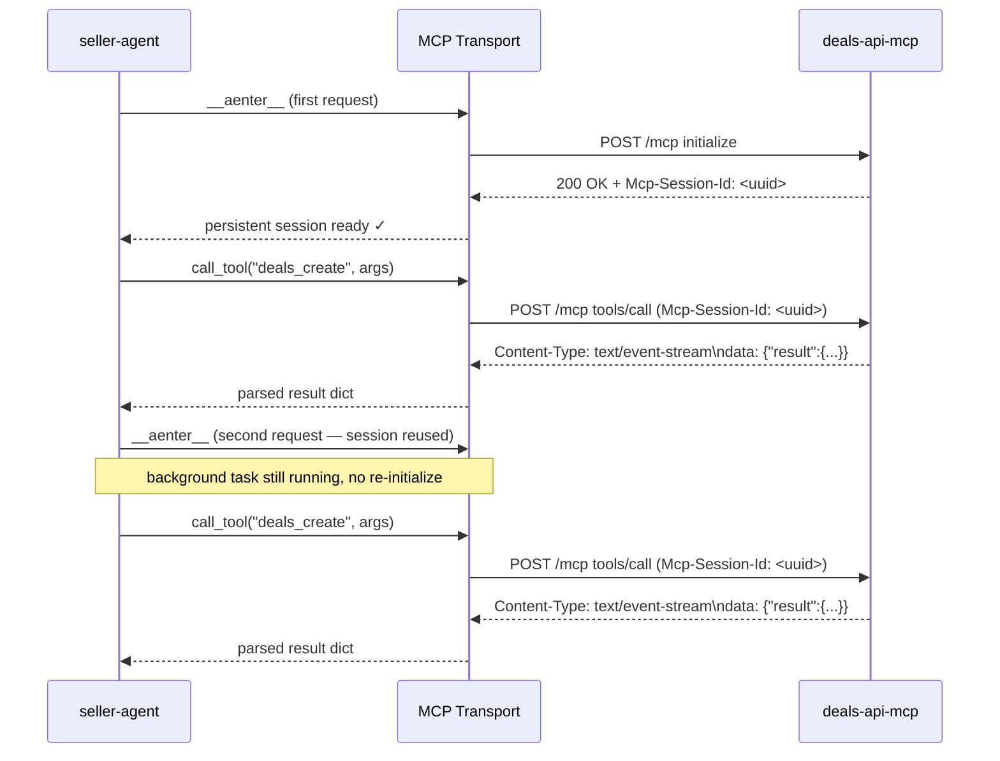

# deals-api-mcp Integration

The seller agent can distribute deals through [deals-api-mcp](https://github.com/IABTechLab/deals-api-mcp) — an MCP server that implements the IAB Deal Sync API v1.0. The seller agent talks to it over **MCP Streamable HTTP**.

## How It Fits Together

```
seller-agent (Python)
  └── DealsAPIMCPClient        ← DealSyncClient implementation
        └── MCP Transport      ← MCP Streamable HTTP transport
              └── deals-api-mcp  ← MCP server (TypeScript, SQLite)
```

`DealsAPIMCPClient` implements the `DealSyncClient` interface and is registered in the deal-sync registry (a peer of the SSP registry). All operations are exposed through the seller agent's standard REST API — no direct access to the connector is needed.

## Prerequisites

Start `deals-api-mcp` in HTTP mode before the seller agent connects:

```bash
MCP_TRANSPORT=http MCP_PORT=3100 NODE_ENV=demo node dist/index.js
```

The server listens at `http://localhost:3100/mcp`. See [deals-api-mcp HTTP Streamable Transport](https://github.com/IABTechLab/deals-api-mcp#http-streamable-transport) for full env var details.

## Configuration

Enable the connector via environment variables:

```bash
DEAL_SYNC_CONNECTORS=deals_api_mcp
DEALS_API_MCP_URL=http://localhost:3100/mcp
DEALS_API_MCP_SELLER_ORIGIN=publisher.example.com
DEALS_API_MCP_KEY=                        # omit for NODE_ENV=demo
```

| Variable | Description |
|----------|-------------|
| `DEAL_SYNC_CONNECTORS` | Comma-separated list of active deal-sync providers. Include `deals_api_mcp` to enable. |
| `DEALS_API_MCP_URL` | Full URL of the deals-api-mcp `/mcp` endpoint |
| `DEALS_API_MCP_SELLER_ORIGIN` | Publisher domain stamped on every created deal |
| `DEALS_API_MCP_KEY` | Auth key. Required when `NODE_ENV=production`; omit in demo mode |

## Operations

### Distribute (Create) a Deal

```bash
curl -X POST http://localhost:8000/api/v1/deals/distribute \
  -H "Authorization: Bearer <api_key>" \
  -H "Content-Type: application/json" \
  -d '{
    "deal_id": "your-internal-deal-id",
    "ssp_name": "deals_api_mcp",
    "name": "Q3 Sports Video",
    "advertiser": "Acme Corp",
    "cpm": 25.00,
    "deal_type": "PMP",
    "start_date": "2026-07-01T00:00:00Z",
    "end_date": "2026-09-30T00:00:00Z",
    "buyer_seat_ids": ["seat-001"]
  }'
```

Response:

```json
{
  "deal_id": "8b3f9cfe-7716-48e0-94bf-42fe44595928",
  "external_deal_id": "IAB-Q3SPORTS001",
  "channel": "deal_sync",
  "provider": "deals_api_mcp",
  "provider_name": "IAB Deals MCP",
  "status": "created",
  "deal": { "name": "Q3 Sports Video", "cpm": 25.00, "external_deal_id": "IAB-Q3SPORTS001", ... }
}
```

`deal_id` is the internal UUID (e.g. `8b3f9cfe-...`) required by MCP tools. `external_deal_id` is the OpenRTB / IAB deal ID (e.g. `"IAB-..."`) that DSPs need for activation — it is also present on the nested `deal` object and in `DEAL_SYNCED` event payloads.

Omit `ssp_name` to let the seller agent route based on `SSP_ROUTING_RULES`.

### Troubleshoot a Deal

```bash
curl "http://localhost:8000/api/v1/deals/8b3f9cfe-7716-48e0-94bf-42fe44595928/ssp-troubleshoot?ssp_name=deals_api_mcp" \
  -H "Authorization: Bearer <api_key>"
```

Returns the deal's buyer seat statuses and any rejected seats flagged as primary issues.

## Status Mapping

`deals-api-mcp` returns seller status as an integer (`sellerStatus`). The connector normalizes it:

| `sellerStatus` | IAB label | Normalized status |
|---------------|-----------|-------------------|
| `0` | Active | `active` |
| `1` | Paused | `paused` |
| `2` | Pending | `created` |
| `4` | Complete | `expired` |
| `5` | Archived | `archived` |

!!! warning "Buyer vs seller status codes share the integer space"
    A buyer-side `0` (Pending) is not the same as a deal-side `0` (Active). They live on different objects — `deal.sellerStatus` vs `buyerSeat.buyerStatus`. Always check which field you are reading.

## Connection Lifecycle



!!! note "Persistent session"
    `deals-api-mcp`'s TypeScript MCP SDK sets `_initialized = true` on the first `initialize` and never resets it — `close()` does not clear the flag. A second `initialize` after any session termination permanently fails with `400 Bad Request: Server already initialized` for the lifetime of the process.

    `DealsAPIMCPClient` handles this via a **class-level persistent background task**: the MCP session is created once on first use and held open indefinitely. Every subsequent `async with ssp:` block reuses the existing session without re-initializing.

## Related

- [deals-api-mcp README](https://github.com/IABTechLab/deals-api-mcp#readme) — server setup, all 10 MCP tools, data models
- `src/ad_seller/clients/deals_api_mcp_client.py` — source for `DealsAPIMCPClient`
